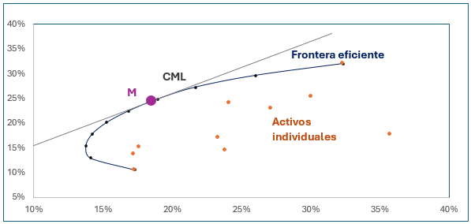

# Portafolio-con-Python
Portafolios de inversión en Python basado en la Teoría Moderna de Portafolios:

## Descripción del proyecto

Este proyecto implementa y compara dos enfoques clásicos de teoría de portafolios: el portafolio mínima varianza (PMV) y el portafolio óptimo (M) basado en CAPM. Utilizando datos reales obtenidos desde Yahoo Finance, se realiza una optimización sujeta a restricciones prácticas (sin venta en corto y beta objetivo), calculando pesos óptimos, rendimientos esperados, riesgos y métricas de desempeño como el Sharpe Ratio.
1. Modelo de Markowitz (PMV) :
   - Riesgo-Rendimiento
   - Riesgo especifico
   - No considera un benchmark ni un 
activo libre de riesgo
2. Modelo de Sharpe (M): 
   - Riesgo-beta
   - Riesgo sistémico
   - Considera un benchmark para 
determinar al mercado y una tasa 
libre de riesgo para determinar la prima

## Tabla de Contenidos

1. [Descripción del Proyecto](#descripción-del-proyecto)
2. [Requisitos](#requisitos)
3. [Estructura del Código](#estructura-del-código)
4. [Características Destacadas](#características-destacadas)
5. [Resultados y Comparaciones](#resultados-y-comparaciones)
6. [Conclusiones](#conclusiones)

## Requisitos

✅ instala la librería de Python llamada QuantStats, que es una herramienta para el análisis de carteras y la evaluación de estrategias de inversión:
 ```python
pip install quantstats
 ```

✅ Necesitaras las siguientes funciones: 
```python
import yfinance as yf
import numpy as np
import pandas as pd
import matplotlib.pyplot as plt
import quantstats as qs
import plotly.express as px
from scipy.stats import norm
import random
 ```
## Estructura del código 
1. Obtener los retornos: 
 - Para las 10 acciones
 - Benchmark

2. Rendimiento esperado de cada acción: media aritmética de los promedios del activo (anualizado)

3. Riesgo de cada acción anualizado: se mide a través de la varianza y para estandarizar la métrica se usa la desviación estándar (σ)

4. Rendimiento esperado del portafolio:

$$
E(r_p) = w_aE(r_a) + w_bE(r_b)
$$

  Donde:
 
   W = peso del activo en el portafolio.
 
   E = rendimiento esperado del activo.

5. Riesgo del portafolio:

$$
Var(p) = [w_a^2 * \sigma_a^2] + [w_b^2 * \sigma_b^2] + [2w_a w_b COV_{a,b}]
$$

6. Portafolio Mínima Varianza (PMV): es aquel con la menor varianza posible de entre todas las combinaciones existentes de los activos con riesgo. 


7. Optimización
   - Capital Market Line es la línea tangente que se dibuja a partir de invertir todo en el activo libre de riesgo y se va formado con las diferentes combinaciones entre el portafolio.
   - Portafolio óptimo (M) es aquel que maximiza la relación riesgo y rendimiento de todas las combinaciones posibles

✅ Portafolio M: 

```python
# Encuentra el índice del portafolio con el mayor ratio de Sharpe
max_sharpe_ind = np.argmax(portf_results_df.sharpe_ratio)

# Extrae los detalles del portafolio óptimo
max_sharpe_portf = portf_results_df.loc[max_sharpe_ind]

# Muestra el rendimiento del portafolio
print('Maximum sharpe ratio portfolio')
print('Performance:')
for index, value in max_sharpe_portf.items():
    if index != 'sharpe_ratio':
        print(f'\n{index}: {100 * value:.2f}%', end="")  # Convierte a porcentaje
    else:
        print(f'\n{index}: {value:.2f}', end="")  # Ratio de Sharpe con dos decimales

# Imprime los pesos de los activos en la cartera
print('\nWeights:')
for x, y in zip(tickers, weights[np.argmax(portf_results_df.sharpe_ratio)]):
    print(f'{x}: {100 * y:.2f}%', end="")  # Convierte a porcentaje
 ```
   - Índice de Sharpe: relaciona la prima de riesgo contra el riesgo propio de la inversión

$$
Is = \frac{E(r_p) - rf}{SD(p)}
$$


   - Beta: mide la sensibilidad de un activo respecto al mercado, es una herramienta para medir el riesgo sistémico

$$
\beta_p = \frac{COV(R_p, R_m)}{VAR(m)}
$$

✅ Beta: 

```python
# Asegura que returns_df tenga el mismo índice temporal que benchmark_returns_df
returns_df = returns_df.loc[benchmark_returns_df.index]

# Define la tasa libre de riesgo anualizada
Rf = 0.05 / 252  

# Calcula los betas de los activos comparándolos con el índice S&P 500
betas = {}
for col in returns_df.columns:
    cov = returns_df[col].cov(benchmark_returns_df['^GSPC'])  # Covarianza con el índice
    var = benchmark_returns_df['^GSPC'].var()  # Varianza del índice
    calculated_beta = cov / var  # Beta del activo
    betas[col] = calculated_beta

# Calcula el retorno esperado del mercado anualizado
Rm = benchmark_returns_df['^GSPC'].mean() * 252  

# Define los pesos de los activos en el portafolio
weights = {
    'MSFT': 0.0792,
    'IBM': 0.0426,
    'MCD': 0.1961,
    'V': 0.0242,
    'AXP': 0.1429,
    'HD': 0.0751,
    'WMT': 0.0201,
    'CAT': 0.1153,
    'KO': 0.0221,
    'AAPL': 0.2824
}

# Convierte los diccionarios a series de pandas
betas_series = pd.Series(betas)
weights_series = pd.Series(weights)

# Calcula el beta del portafolio como la suma ponderada de los betas individuales
portfolio_beta = (betas_series * weights_series).sum()

# Muestra el beta del portafolio con cuatro decimales
print(f"Beta del portafolio: {portfolio_beta:.4f}")
 ```


## Características Destacadas

- Obtención de datos reales de al menos 10 acciones y el índice de mercado utilizando yfinance.
- Optimización: Las restricciones incluyen inversión total del 100%, sin short-selling y un objetivo de beta del portafolio igual a 1
- Comparación entre estrategias: Se analiza el rendimiento y riesgo del portafolio de mínima varianza versus el portafolio óptimo bajo CAPM.

$$ E(r_i) = r_f + \beta [E(r_m) - r_f] $$

✅ CAPM: 

```python
CAPM = Rf + portfolio_beta * (Rm - Rf)
```

- Cálculo de métricas clave:
   - Pesos óptimos por activo
   - Rendimiento esperado del portafolio
   - Beta total del portafolio
   - Sharpe Ratio (como indicador de eficiencia ajustada por riesgo)

## Resultados y Comparaciones

- Portafolio óptimo
  

| Concepto     | Valor    |
| ------------ | --------:|
| Rendimiento  | 21.59%   |
| Riesgo       |   20.05% |
| I. Sharpe    |    1.08  |

Estructura

| Acción       |   Peso   |
| ------------ | --------:|
| MSFT         |  7.26%   |
| IMB          |  2.64%   |
| MCD          |  15.84%  |
| V            |  2.31%   |
| AXP          |  12.29%  |
| HD           |  3.31%   |
| WMT          |  6.13%   |
| CAT          |  7.26%   |
| MSFT         |  7.26%   |

