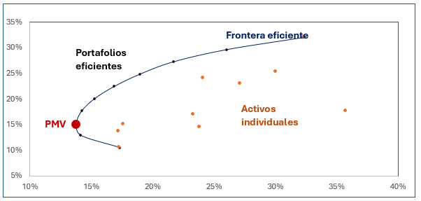

# Portafolio-con-Python
Portafolios de inversión en Python basado en la Teoría Moderna de Portafolios:

## Descripción del proyecto

Este proyecto implementa y compara dos enfoques clásicos de teoría de portafolios: el portafolio mínima varianza (PMV) y el portafolio óptimo (M) basado en CAPM. Utilizando datos reales obtenidos desde Yahoo Finance, se realiza una optimización sujeta a restricciones prácticas (sin venta en corto y beta objetivo), calculando pesos óptimos, rendimientos esperados, riesgos y métricas de desempeño como el Sharpe Ratio.
1. Modelo de Markowitz (PMV) :
   - Riesgo-Rendimiento
   - Riesgo especifico
   - No considera un benchmark ni un 
activo libre de riesgo
2. Modelo de Sharpe (M): 
   - Riesgo-beta
   - Riesgo sistémico
   - Considera un benchmark para 
determinar al mercado y una tasa 
libre de riesgo para determinar la prima

## Tabla de Contenidos

1. [Descripción del Proyecto](#descripción-del-proyecto)
2. [Requisitos](#requisitos)
3. [Estructura del Código](#estructura-del-código)
4. [Características Destacadas](#características-destacadas)
5. [Resultados y Comparaciones](#resultados-y-comparaciones)
6. [Conclusiones](#conclusiones)

## Requisitos

✅ instala la librería de Python llamada QuantStats, que es una herramienta para el análisis de carteras y la evaluación de estrategias de inversión:
 ```python
pip install quantstats
 ```

✅ Necesitaras las siguientes funciones: 
```python
import yfinance as yf
import numpy as np
import pandas as pd
import matplotlib.pyplot as plt
import quantstats as qs
import plotly.express as px
from scipy.stats import norm
import random
 ```
## Estructura del código 
1. Obtener los retornos: 
 - Para las 10 acciones
 - Benchmark

2. Rendimiento esperado de cada acción: media aritmética de los promedios del activo (anualizado)

3. Riesgo de cada acción anualizado: se mide a través de la varianza y para estandarizar la métrica se usa la desviación estándar (σ)

4. Rendimiento esperado del portafolio:

$$
E(r_p) = w_aE(r_a) + w_bE(r_b)
$$

  Donde:
 
   W = peso del activo en el portafolio.
 
   E = rendimiento esperado del activo.

5. Riesgo del portafolio:

$$
Var(p) = [w_a^2 * \sigma_a^2] + [w_b^2 * \sigma_b^2] + [2w_a w_b COV_{a,b}]
$$

6. Portafolio Mínima Varianza (PMV): es aquel con la menor varianza posible de entre todas las combinaciones existentes de los activos con riesgo. 



7. Optimización
   - Capital Market Line es la línea tangente que se dibuja a partir de invertir todo en el activo libre de riesgo y se va formado con las diferentes combinaciones entre el portafolio.
   - Portafolio óptimo (M) es aquel que maximiza la relación riesgo y rendimiento de todas las combinaciones posibles
   - Índice de Sharpe: relaciona la prima de riesgo contra el riesgo propio de la inversión

$$
Is = \frac{E(r_p) - rf}{SD(p)}
$$

   - Beta: mide la sensibilidad de un activo respecto al mercado, es una herramienta para medir el riesgo sistémico

$$
\beta_p = \frac{COV(R_p, R_m)}{VAR(m)}
$$


